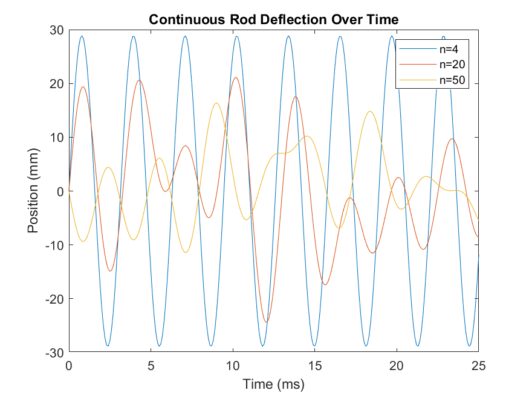

# ME3220Honors
This code is intended to serve as a 1D finite element analysis for a beam that deflects in the transverse direction. The code takes an input the number of segments the beam is divided into (n), the density (rho), the cross-sectional area (A), Young's Modulus (E), and the length of the beam (L) and returns the response of the beam in the transverse direction over time for a specified time range.


This first function sets up the mass matrix for the beam using an ODE.
```matlab
function M = mass(n,rho,A,L)
M = zeros(size(n+1));
C = rho*A*L/n/420;
matrix_m = 2/3*diag(ones(n+1,1))+1/6*diag(ones(n,1),1)+1/6*diag(ones(n,1),-1);
matrix_m(1,1) = 1/3; 
matrix_m(n+1,n+1) = 1/3;
M = C.*matrix_m;
M = M(2:n+1,2:n+1);
end
```


The second function sets up a matrix for the stiffness of the beam
```matlab
function K = stiffness(n,A,E,L)
K = zeros(size(n+1));
r_2 = A/pi();
I = (pi()/4)*r_2^2;
C = E*I/(L/n)^3;
%C = n*A*E/L;
matrix_k = 2*diag(ones(n+1,1))-1*diag(ones(n,1),1)-1*diag(ones(n,1),-1);
matrix_k(1,1) = 1;
matrix_k(n+1,n+1) = 1;
K = C.*matrix_k;
K = K(2:n+1,2:n+1);
end
```


The third function sets up an ODE that will solve for the natural frequencies and eigenvectors of the beam.
```matlab
function [w,u]=KM_solve(K,M)
[u,w] = eig(K,M);
w = sqrt(w);
w = diag(w);
end
```


This final code takes all the previously defined ODE solvers and gives them inputs for a standard beam. Responses for a beam divided into 4, 20, and 50 segments are plotted on a graph for comparison.
```matlab
A = 0.2;
E = 200*10^9;
rho = 8050;
L = 10;
for n = [4, 20, 50]
    K = stiffness(n,A,E,L);
    m = mass(n,rho,A,L);
    [w,u]=KM_solve(K,m);
    t_end = 2*pi/min(w);
    t = 0:0.00001:0.008;
    init = zeros(2*n,1);
    init(2*n) = -0.1;
    matrix_1 = zeros(n,2*n);
    matrix_2 = zeros(n,2*n);
    for i=2:n+1
        matrix_1(:,2*(i-1)) = u(:,i-1);
        matrix_2(:,2*i-3) = u(:,i-1);
    end
    matrix_3 = [matrix_1;matrix_2];
    coeff = matrix_3\init;
    solution = u(:,1)*coeff(1)*sin(w(1)*t);
    
    for i = 2:numel(w)
        solution = solution + u(:,i)*coeff(i)*sin(w(i)*t);
    end
    f = figure(1);
    plot(t*1000,solution(n,:))
    hold on;
    
end
title('Continuous Rod Deflection Over Time');
xlabel('Time (ms)')
ylabel('Position (m)')
legend('n=4','n=20','n=50'); 
saveas(f,'HonorsProject.png');
```


